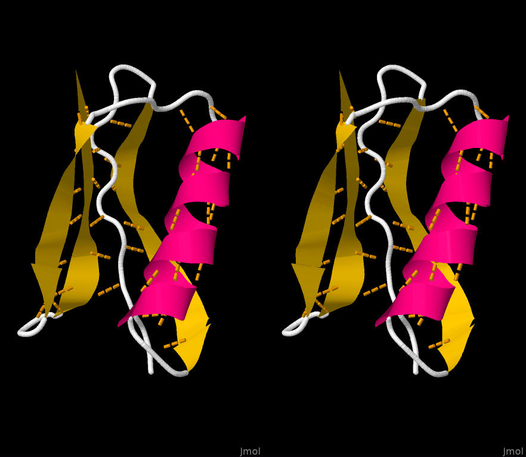

# jmol

## Learn/experiment with writing scripts for the Jmol molecular-biology visualizer.

## REFERENCES

### Exploring Proteins and Nucleic Acids with Jmol (pdf) (Revised February 12, 2021)
##### Jeffrey A. Cohlberg, Department of Chemistry and Biochemistry, California State University, Long Beach

### Figure: Protein 1PGB showing hydrogen bonds, presented in 'wall-eyed' stereo (from cohlberg_01B.txt exercise).

